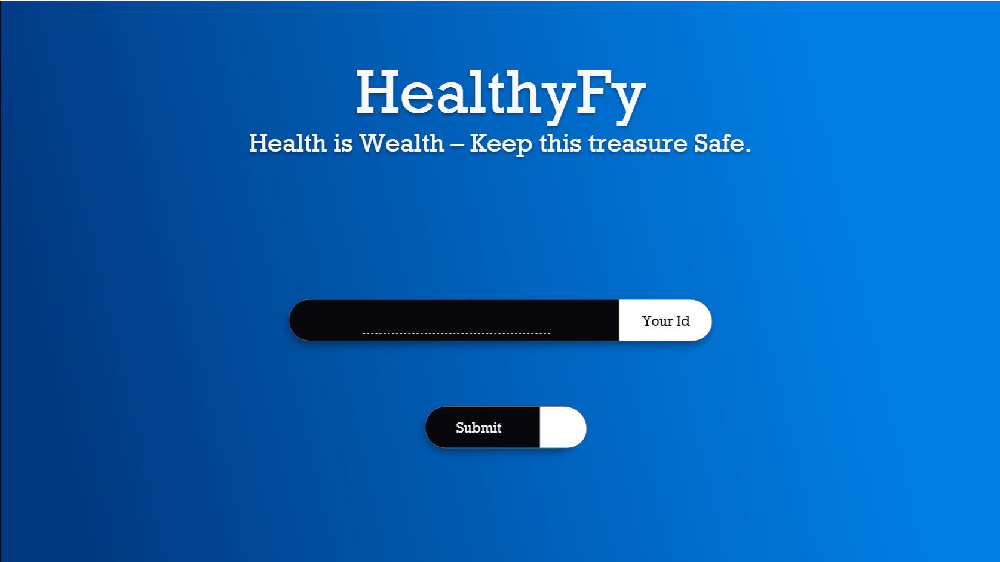
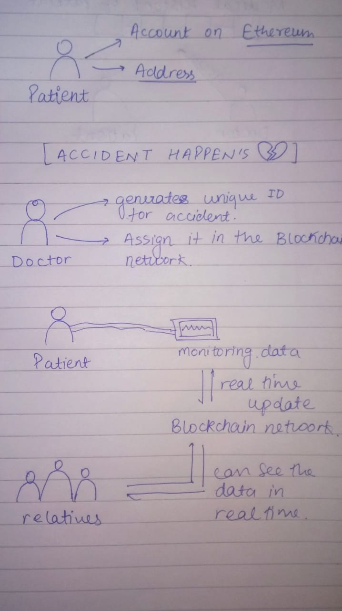

# 🔥 HashHack 3.0 🔥


## Abstract 🎇

### Problem statement 🤔

- People **do not get informed of the real time situation** of their close one who is admitted in ICU 📈.

- Fraud happens by the authority of presenting the fake data to the relatives and **charge them huge sum of money 💰 for no cause**.

- **Keeping the medical history of a person in an organized manner 📑** that is easily accessible to the person and for the doctor who is going to treat also.

### Proposed Solution 😎

- **By keeping the track of the data on a Block-chain ⛓** network in **real time ⏳** directly from machine with an analysis (to make easily understandable) so that their close ones can see the status.
- This will provide a **robust model which is not interfered by any human being 🤬** and ultimately will lead to **Fraud Free health-care system 👩‍⚕️**.

- The patient's data is updated on a block-chain network. It will keep the **history of the person health throughout his/her life 📄** & Doctors who are treating him or her **can see the history and treat accordingly 💉**.

### Fields Covered

- Block Chain ⛓️
- Machine Learning tool🤖
- Health Care 🏥💓

## UI



## Representational Model



# Documentation 📃

### <span style=" ; font-weight : 700"> Function used </span>

| <span style="color:blue"> Function</span> | <span style="color:blue"> &nbsp; &nbsp; &nbsp;Signatures</span> | <span style="color:blue"> &nbsp; &nbsp; &nbsp; &nbsp;returned value</span> |
| ----------------------------------------- | --------------------------------------------------------------- | -------------------------------------------------------------------------- |
| addAccident                               | &nbsp; &nbsp;&nbsp; address , uId                               | &nbsp; &nbsp; &nbsp; &nbsp;Data                                            |

```
function addAccident(address patientAddress, uint uid) public {
        patientData[patientAddress].push(uid);
    }
```

<details><summary>Click to see more</summary><br>

> This function takes the address of node and unique if of node and push and node to the block chain network

</details>
</br>
</br>
</br>

| <span style="color:blue"> Function</span> | <span style="color:blue"> &nbsp; &nbsp; &nbsp;Signatures</span> | <span style="color:blue"> &nbsp; &nbsp; &nbsp; &nbsp;returned value</span> |
| ----------------------------------------- | --------------------------------------------------------------- | -------------------------------------------------------------------------- |
| getUIDS                                   | &nbsp; &nbsp; &nbsp;address                                     | &nbsp; &nbsp; &nbsp; data                                                  |

```
function getUIDS(address patientAddress) public view returns (uint[]) {
        return patientData[patientAddress];
    }
```

<details><summary>Click to see more</summary><br>

> This function takes the address of patients and and return it unique ID

</details>
</br>
</br>
</br>

| <span style="color:blue"> Function</span> | <span style="color:blue"> &nbsp; &nbsp; &nbsp;Signatures</span> | <span style="color:blue"> &nbsp; &nbsp; &nbsp; &nbsp;returned value</span> |
| ----------------------------------------- | --------------------------------------------------------------- | -------------------------------------------------------------------------- |
| createReport                              | &nbsp; &nbsp; &nbsp; uId , data's                               | &nbsp; &nbsp; &nbsp; Array of reports                                      |

```
   function createReport(uint id, uint data1, uint data2, uint data3) public {
        reports[id].push(Report(data1, data2, data3));
    }
```

<details><summary>Click to see more</summary><br>

> This function takes the unique id of patient's and patient's health related data and return the array of report

</details>
</br>
</br>
</br>

| <span style="color:blue"> Function</span> | <span style="color:blue"> &nbsp; &nbsp; &nbsp;Signatures</span> | <span style="color:blue"> &nbsp; &nbsp; &nbsp; &nbsp;returned value</span> |
| ----------------------------------------- | --------------------------------------------------------------- | -------------------------------------------------------------------------- |
| getReport                                 | &nbsp; &nbsp; &nbsp; uId                                        | &nbsp; &nbsp; &nbsp; Array of data's                                       |

```
function getReports(uint id) public view returns (uint[], uint[], uint[]) {
        for(uint i = 0; i < 3; i++) {
            data1Array.push(reports[id][i].data1);
            data2Array.push(reports[id][i].data2);
            data3Array.push(reports[id][i].data3);
        }
        return (data1Array, data2Array, data3Array);
    }
```

<details><summary>Click to see more</summary><br>

> This function takes the unique ID of patients and return the array of reports

</details>
</br>
</br>
</br>


